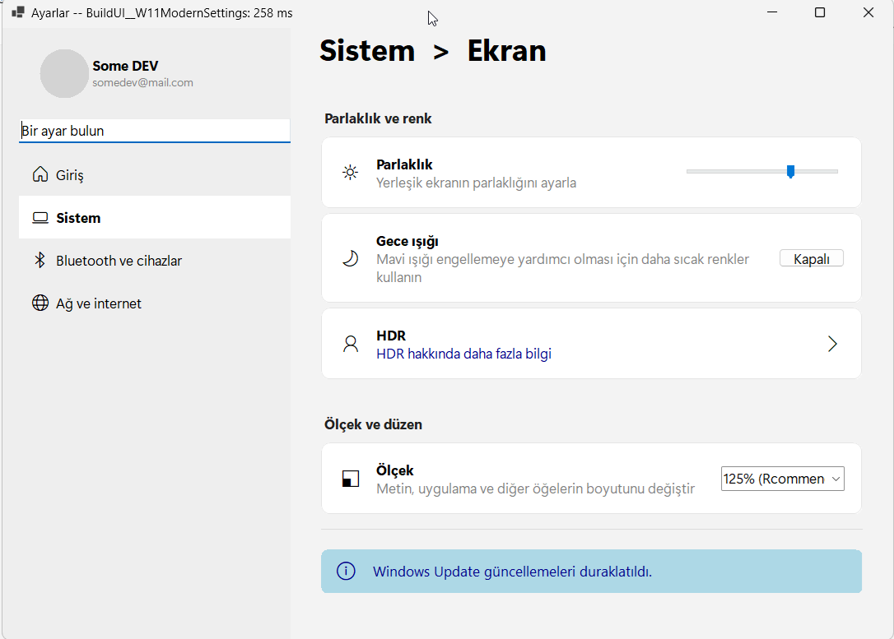

Here is the ultimate, updated **README.md** for your project. It includes all the latest architectural breakthroughs: Zero-Base architecture, Double-Pass Reflow, Custom Components (CardViews), and the Zero-Flicker engine.

***



# 🚀 SmartUI for WinForms

**The Zero-Base, Fluent, and Responsive Layout Engine that makes WinForms feel like React, Flutter, or SwiftUI.**

SmartUI eliminates the 20-year-old struggles of `TableLayoutPanel`, broken anchors, ghost margins, and flickering screens. It allows you to build modern, responsive, DPI-aware, and pixel-perfect interfaces using a clean **Fluent API** entirely in C#.

> **"What you code is exactly what you see on the screen."**

---

## 🔥 Key Features

* **Zero-Base Architecture:** No hidden default margins or paddings. If you don't explicitly set a gap using `.Spacing()`, `.Margin()`, or `.Padding()`, the distance is precisely `0`. You have 100% pixel control.
* **CSS Flexbox in C#:** Use `.GrowW()`, `.GrowH()`, and `.Spring()` to distribute space dynamically and push elements exactly where they belong.
* **Double-Pass Reflow (True Word Wrap):** When the window resizes, text automatically wraps, containers expand, and elements below are pushed down perfectly without overflowing.
* **Zero-Flicker Rendering:** Uses the Win32 `WM_SETREDRAW` API to completely freeze the UI during calculations. Result? Buttery-smooth resizing with zero inter-frame jumping.
* **Responsive Sidebars:** Built-in support for auto-collapsing side panels and a hamburger flyout menu for mobile-like UX.
* **Rounded Corners & Flat Design:** Apply anti-aliased border radius and custom borders to any control instantly using `.Rounded()`.
* **Component-Driven (Reusable Widgets):** Extend the engine using `partial class` to create your own reusable widgets (like CardViews, AlertBoxes, and SidebarItems).
* **Browser-Style Zooming:** Built-in `SetZoom()` method scales fonts, margins, paddings, and control sizes proportionately for 4K/DPI-aware screens.

---

## 🎨 Visual Mapping: The "Code = Layout" Philosophy

With SmartUI, the hierarchy of your code matches the physical layout of your UI. No coordinates, no math.

```csharp
ui.Row(
    ui.Group(
        icoBrightness.Padding(0, 0, 10, 0).VAlignMiddle(),
        
        ui.Col(
            lblTitle, 
            lblDesc.WrapText()
        ).Spacing(0).GrowW() // Zero space between Title and Subtitle
        
    ).VAlignMiddle().GrowW(),
    
    ui.Spring(), // Pushes the toggle button to the far right
    
    btnToggleNight.VAlignMiddle()
)
.BackColor(Color.White)
.Margin(30, 0, 30, 4)
.Padding(18)
.Rounded(8, Color.FromArgb(229, 229, 229)); // Modern rounded card
```

---

## 🛠️ Quick Start

### 1. Initialize the Engine
You no longer need to drag, drop, and align elements carefully in the WinForms Designer. Just instantiate your controls and let SmartUI handle the placement.

```csharp
public partial class SettingsForm : Form
{
    private SmartUI ui;

    public SettingsForm()
    {
        InitializeComponent();
        
        // Initialize the engine for this specific form instance
        ui = new SmartUI(this);

        // Optional: Setup a responsive Hamburger Menu
        ui.SetupResponsiveSidebar(btnHamburger, threshold: 850);

        BuildUI();
    }
}
```

### 2. Build Your UI (Using Component-Driven Architecture)
Instead of writing 15 lines of layout code for every card, you can create reusable composite controls (Widgets) and keep your main UI code incredibly clean:

```csharp
private void BuildUI()
{
    // 1. LEFT SIDEBAR
    ui.SidePanel(Side.Left, 280,
        ui.Group(imgProfile, ui.Col(lblUser, lblEmail)).VAlignMiddle().Padding(20),
        ui.Space(15),
        ui.CreateSidebarItem_v1("\uE80F", "Home"),
        ui.CreateSidebarItem_v1("\uE770", "System", isSelected: true)
    ).BackColor(Color.FromArgb(243, 243, 243));

    // 2. MAIN CONTENT (Using your custom reusable components)
    ui.Row(lblPageTitle).Margin(30, 5, 0, 20);
    
    ui.SmartUI_SectionHeader_v1("Display & Brightness");
    
    ui.SmartUI_CardView_v1("\uE706", "Brightness", "Adjust the brightness of your built-in display", trackBrightness);
    ui.SmartUI_CardView_v1("\uE708", "Night light", "Use warmer colors to help block blue light", btnToggleNight);

    ui.SmartUI_Divider_v1();

    ui.SmartUI_SectionHeader_v1("Scale & Layout");
    ui.SmartUI_CardView_v1("\uE776", "Scale", "Change the size of text, apps, and other items", cmbScale);
}
```

---

## 📚 API Reference Cheat Sheet

### 📦 Containers & Spacers
* `ui.Row(...)` : Creates a full-width horizontal row.
* `ui.Group(...)` : Creates a horizontal container that wraps tightly around its children.
* `ui.Col(...)` : Creates a vertical container (column) for stacking items.
* `ui.SidePanel(...)` : Reserves a region (Left, Right, Bottom). Main content dynamically flows into the remaining space.
* `ui.Space(int)` : Adds a transparent, scalable empty block inside a Group/Col/SidePanel.
* `ui.Gap(int)` : Adds a vertical gap between main `Row`s.

### 📐 Flexbox Rules (Extensions)
* `.GrowW()` : Expands the control horizontally to share available space.
* `.GrowH()` : Expands the control vertically to fill the remaining bottom space of the form.
* `.Spring()` : An invisible spring that consumes all empty space, pushing elements apart.
* `.MatchWidth(target)` : Forces the control to be exactly as wide as the target control.

### 📏 Alignment
* `.AlignRight(target)` : Snaps the control to the right edge of the target.
* `.VAlignMiddle()` : Vertically centers the control inside its row/group.
* `.VAlignBottom()` : Aligns the control to the bottom of its row/group.

### 🖌️ Styling & Spacing (Zero-Base)
* `.Spacing(int)` : Sets the gap between children *inside* a `Group` or `Col`.
* `.Margin(L, T, R, B)` : External margins. Pushes the container away from its surroundings.
* `.Padding(L, T, R, B)` : Internal padding. Pushes children away from the container's edges.
* `.BackColor(Color)` : Sets the background color cleanly.
* `.Rounded(radius, borderColor, thickness)` : Applies anti-aliased rounded corners and optional flat borders.
* `.WrapText()` : (For Labels) Allows the text to break into multiple lines, triggering the layout engine to calculate dynamic heights.

---

*Architected with logic, patience, and 🍌 by a tired but wise developer. WinForms will never be the same.*